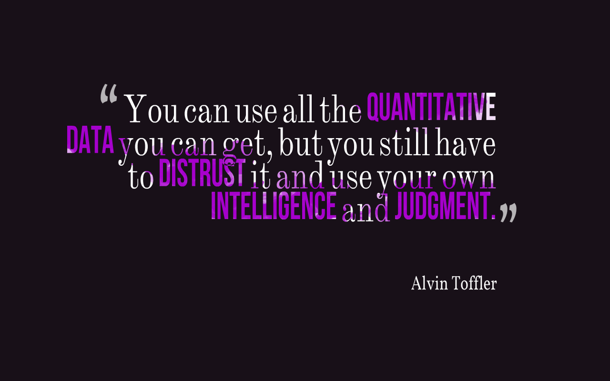

= Future Shock
Alvin Toffler
May 1970

[abstract]
&#9733; &#9733; &#9733; &#9734; &#9734;

_Was a crystal ball for society and technology_

Alvin's insights in this book included many accurate predictions for how society would engage and embrace technology in the past future. The book is an easy read with points that continue to have some resonance.

Have you ever felt that change was coming too fast and frequently? This is a core tenant of Future Shock, written in a time when computer technology was new, adapting, and accelerating; where technology innovation continues presently. Alvin suggests that society and individuals must be willing to adapt as crucial criteria for success. He highlights that organizations and the world itself will adopt more fluid, shifting structures and interactions based on enabling technology. The internet as well as personal devices today are perfect examples for the fluid nature of how our social, professional and personal interactions with technology are tightly intertwined. However, he warns of the importance in striking a balance between real-world "actual" interactions and virtual "vicarious" experiences. We have all seen negative effects of technology and social engagement in our lives and communities that usually stem from assumptions that our digital or "virtual" experiences are not the same as in real life, leading to communications and actions that would otherwise never occur. He goes further to suggest that we must identify and develop personal "stability zones" that nurture our personal connections to one another or risk getting lost along the way, such as maintaining a healthy diet, exercise and leisure with strong, intimate relationships.

Alvin successfully predicts that success supported by technology would necessitate invention simply to remain competitive while also emphasizing the important role of collaborative governance among businesses and governments as new technology is developed and introduced. He also correctly forecasts product variety and consumer choice as a result of all of this technology creation.

