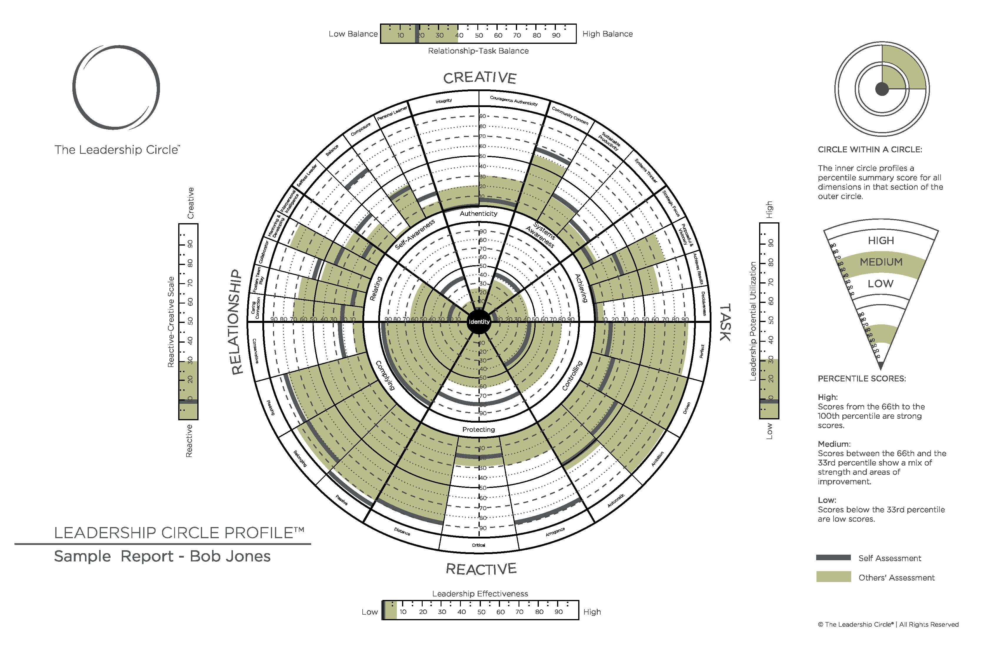

# Scaling Leadership: Building Organizational Capability and Capacity to Create Outcomes that Matter Most

&#9734; &#9734; &#9734; &#9734;

_Fresh update of the author's original work Mastering Leadership_

This book is certainly founded on their earlier work and tools outlined in "Mastering Leadership" and provides a fresh perspective on leadership today. Borrowing from their "reactive", "creative", and "integral" growth stages of leadership, Robert and Bill extend these models and highlight the common leadership theme that "leaders create leaders" in order to scale up a business. They also tie in the importance of servant leadership as an attribute of an "integral" leader.

They reference their own Leadership Circle Profile Self-Assessment tool (as shown in the attached figure). While interesting, this unabashed self-promotion of consulting tools could alienate readers. The authors also make reference to the VUCA business acronym, "Volatility, Uncertainty, Complexity, and Ambiguity" introduced in 1985 by Warren Bennis and Nanus Burt in their book "Leaders: Strategies for Taking Charge". VUCA was adopted for use as a tool by the US military and steadily gained traction in business leadership. While perhaps useful as a business tool, VUCA is a bit of a "crutch" as Harvard Business Review wrote in 2014 where leaders are likely to get more value from objective qualitative and quantitative measurements to affect and influence their strategy.

Each leader must make an introspective examination of their own strengths and weaknesses, focusing on the single most important change they can make to develop forward before they can focus on building their teams and leadership systems. In doing so, they form meaningful partnerships with their teams and make every effort to work transparently, learning openly from others. Feedback loops are a critical function of their formalized leadership systems and they work intentionally and with purpose.

Learning > Knowing
Empowering > Controlling

Despite the book's shortcomings, the content still holds significant value when used alongside other leadership resources.

