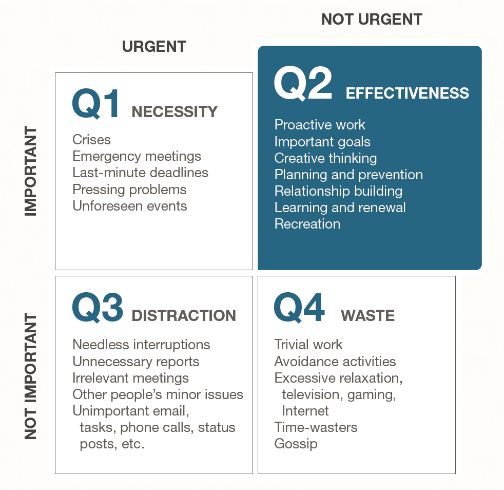

# The 7 Habits of Highly Effective People

_Provide advice applied by millions over decades_

This book is a timeless epic of leadership guidance that has proven its worth to millions over decades of applied practice.

Much of the leadership and personal self-help advice is based directly or indirectly on Stephen Covey's own leadership on coaching individuals to be better for themselves and for others. Readers who are new to the book and experienced with more recently released books on the topic may find this book redundant, since their advice will largely be built on the fundamentals of this 7 Habits book.

I have personally found myself referring back to the Circle of Control and Concern, the quadrant of "Put first things First", and the importance of focusing on and finding Win-Win discovery through collaboration that is better than any solution offered may bring to the negotiating table with all of our assumptions, expectations and biases.

