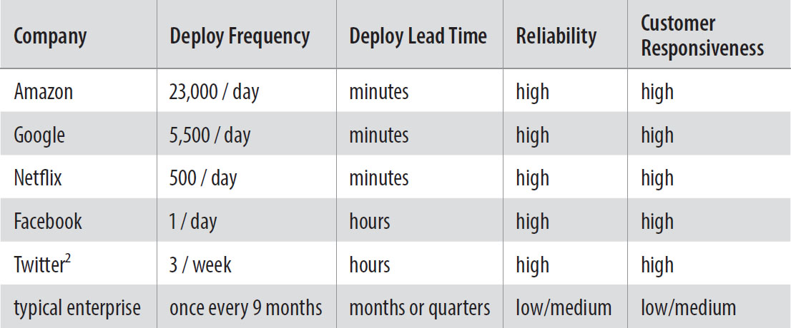

# The Phoenix Project

_An inspiring and fundamental DevOps story_

Readers should consider this book as a background reference to current DevOps literature.

The Phoenix Project reads as a transformational story that challenges traditional IT and proposes a DevOps mindset for applied continuous improvement. This book has been frequently referenced throughout the IT DevOps movement as a primary driver for the community's vision.

Re-imagining a holistic IT integration, development is re-integrated with operations as a single continuum of value delivery or "value stream" with applied Lean thinking and a focus on rapid, production delivery feedback loops. DevOps is introduced as a strategy that aligns IT delivery and directly contributes to improve quality, customer satisfaction, and innovation.

Like many of the process improvements in Information Technology, DevOps is another iteration of industry-wide learning largely based on lessons already learned in product manufacturing and the applied science of measuring production and in making delivery improvements. The authors focus on the associated need to understand bottlenecks and constraints as outlined in Dr. Eliyahu Goldratt's 1980 article "What is this thing called Theory of Constraints and how should it be implemented" and further circulated into the minds of leadership and management through his very successful novel "The Goal" in 1984.

The authors work to dispel myths and relate DevOps to topics like Agile, ITIL, NoOps, open vs. closed source, Infrastructure as Code, automation, and start-up or "unicorn" businesses.

The "Three Ways" to accomplish this are outlined as:

1. **The First Way:** deliver in small batches of quality work to maximize flow (readers can reference Lean and Kanban as process examples); optimizing for global goals. "The necessary practices include continuous build, integration, and deployment, creating environments on demand, limiting work in process, and building safe systems and organizations that are safe to change."

2. **The Second Way:** fast feedback with applied learning as close to the source as possible. "The necessary practices include "stopping the production line" when our builds and tests fail in the deployment pipeline; constantly elevating the improvement of daily work over daily work; creating fast automated test suites to ensure that code is always in a potentially deployable state; creating shared goals and shared pain between Development and IT Operations; and creating pervasive production telemetry so that everyone can see whether code and environments are operating as designed and that customer goals are being met."

3. **The Third Way:** always experiment to improve by taking risks, learn and to practice success and failure through repetition. "The necessary practices include creating a culture of innovation and risk taking (as opposed to fear or mindless order taking) and high trust (as opposed to low trust, command-and-control), allocating at least twenty percent of Development and IT Operations cycles towards nonfunctional requirements, and constant reinforcement that improvements are encouraged and celebrated."

