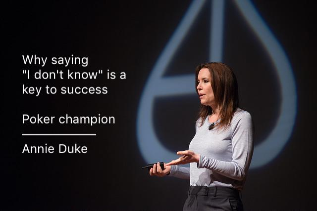

= Thinking in Bets: Making Smarter Decisions When You Don't Have All the Facts
Annie Duke
2018

[abstract]
&#9733; &#9733; &#9733; &#9733; &#9734;

_Accepting that we are not sure and improving decision making._

Learn to make better decisions by understanding your biases, quantifying the information available to you as time allows, and leveraging others to improve outcomes. This book offers few revolutionary insights into decision making and the biases that influence them, but Annie's unique story helps to reflect on fundamental truths.

Annie Duke is no stranger to making important decisions with not enough information and argues that luck and skill are involved in our every decision. With advanced degrees in English and psychology, multiple poker championships and millions in winnings, Annie sets out to translate her success to business and our everyday decisions.

Annie points out that we have fundamental biases and that our brains are predisposed to seek out information that supports our existing beliefs and even disregard truths that conflict with them. Her book highlights the importance of avoiding thinking that only two options exist and embracing a continuum of unknown possibilities in between. Accept that both winning and losing are always possible outcomes and that the journey toward a choice is what matters.

This book suggests that decisions should be made with trusted and diverse groups, leveraging others to identify and balance one another's biases including our own. She refers to this as a "decision pod", "truthseeking group", "buddy system", and "decision group". The group must adopt a new "social contract" for open-mindedness, taking responsibility for themselves and giving credit to others when credit is due.

Annie encourages us to value the decision making process, especially since the outcome is not usually in our control and to avoid correlating your best and worst decisions by best and worst outcomes. Instead, judge the quality of our decisions on what we control and understand and perhaps based on average outcomes. Accept that outcomes are never 100% luck or 100% skill. We should exercise caution after a streak of positive or negative outcomes to avoid becoming emotionally charged in a way that prevents us from thinking clearly; taking action to regain a healthy perspective. Refocusing on the potential long-term impact of our decisions can also help reframe our decisions. You may also employ ["Ulysses Contracts"](https://en.wikipedia.org/wiki/Ulysses_pact) to guard your decisions and behavior.

Annie challenges us to evaluate our current beliefs and to listen to arguments against them to get a clearer picture of the truth. Observe the world around you and learn from the choices that other people make by observing.

